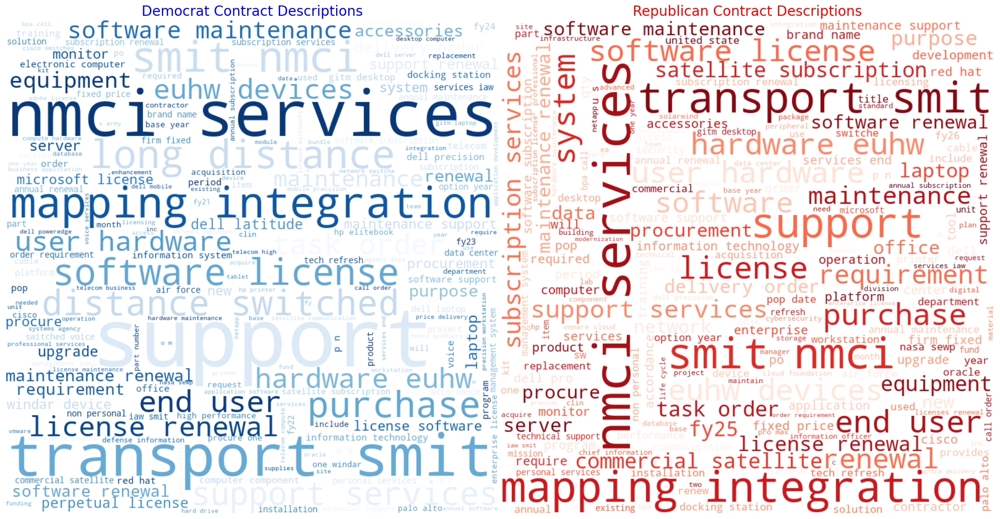
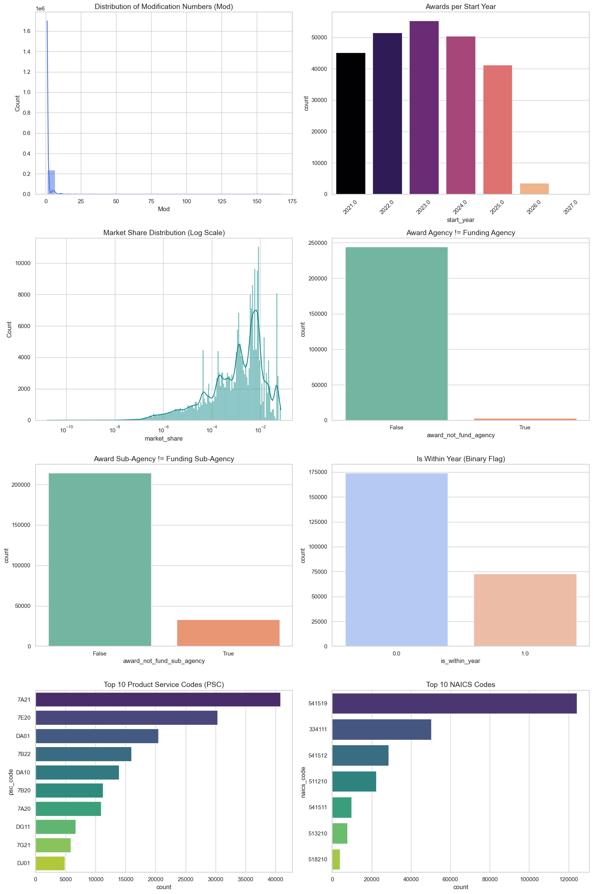
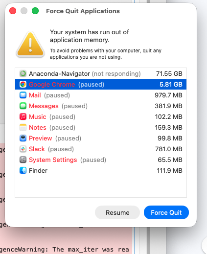

# Week 7 Project Reflection
### What you have achieved so far?
This week I finalized the feature engineering and data cleaning, as well as created first versions of models for **modifications within one year (binary)**, **whether or not a contract overspends awards (binary)**, and **total value of contract award (regression)**. 

#### Feature Engineering:
- Created yearly market share for the year prior at the company level based on total award amount divided by total awards for that year.
- Created binary flags for Awarding Agency Not equal to funding agency and Sub agency equivalent
    - This will help understand if there is a bias due to multiple agencies / sub agency scope creep
- Fixed modification within 1 year variable
    - Originally this was massively overpredicting due to a syntax error that I reviewed and updated
- Used Sentence Transformer model `all-MiniLM-L6-v2` and applied to the description column of each award contract to create vector embeddings of size 384
    - Created pandas dataframe with associated columns and saved data in csv (`contract_embeddings.csv`)
    - Used UMAP dimensionality reduction to inspect embeddings and visualize in two dimensions
 
#### Visualization
- Inspected data distributions of both predictor and response variables. Looked for signs of class imbalance.
- Understood which agencies and sub agencies are winning the majority of these technology contracts
- Created heat map to shows states with most contracts by total amount
- Instead of creating a model for republican versus democrat associations, I felt a wordcloud and descriptive statistics would give enough insight. This is another accomplishment, which shows that there is not much of a difference in top level keywords that democrat versus republican adminstrations are including in their software contracts.


  
#### Data Pipeline and Standardization
- Wrote data to `preprocessed_award_data.csv`, which contains all the data with cleaned features
- Within the Machine learning layer created data pipeline that dealt with NA's appropriately and used a standard column transformer to standard scale continuous variables and one hot encode categorical variables specified.
- This transformation will be used both on the validation and testing set, as well as during inference, so it is important to ensure reproducibility.

#### Hyperparameter Tuning
I used Hyperparameter Tuning to test different model structure (Logistic (or Linear) Regression, Decision Tree, Random Forest, XGBoost) usign 5-fold cross validation and grid search across a predefined set of hyperparameters. I used this same process across the three prediction tasks of **modifications within one year (binary)**, **whether or not a contract overspends awards (binary)**, and **total value of contract award (regression)**.

I was able to make the output verbose, and directly inspect the result of each hyperparameter / fold output. Additionally, I wrote robust code that would take the best set of hyperparameters and retrain on the entire set of training data. This was then applied to the testing set for validation.

#### Model Evaluation and Metric Repository
Once a model is created, we need to be able to reuse it. It is important to have a repository that hosts all the models with proper versioning and naming conventions. Additionally, anyone using the model should know the evaluation metrics of it. I created a system that saves a model to a specified location with an informative name as a joblib file. In the same process, evaluation metrics are stored in the csv that point to the model name and file location.

This will make deployment, analysis, and improvement of the model much easier when building a user facing application.

#### Results:
##### Modification
| # | model_name | model_location | precision | recall | f1_score | weighted_avg_f1 | macro_avg_f1 |
|:---|:---|:---|:---|:---|:---|:---|:---|
| 1 | Logistic Regression_embed_v1 | models/logistic_regression_model_embed_v1.joblib | 0.7014 | 0.4023 | 0.5113 | 0.7523 | 0.6821 |
| 2 | Decision Tree_embed_v1 | models/decision_tree_model_embed_v1.joblib | 0.7033 | 0.4128 | 0.5202 | 0.7557 | 0.6871 |
| 3 | Random Forest_embed_v1 | models/random_forest_model_embed_v1.joblib | 0.7097 | 0.3649 | 0.4820 | 0.7428 | 0.6668 |
| 4 | XGBoost_embed_v1 | models/xgboost_model_embed_v1.joblib | 0.7377 | 0.4824 | 0.5833 | 0.7829 | 0.7247 |
| 5 | Logistic Regression_v1 | models/logistic_regression_model_v1.joblib | 0.6978 | 0.3451 | 0.4618 | 0.7346 | 0.6551 |
| 6 | Decision Tree_v1 | models/decision_tree_model_v1.joblib | 0.7169 | 0.4324 | 0.5395 | 0.7642 | 0.6987 |
| 7 | Random Forest_v1 | models/random_forest_model_v1.joblib | 0.6149 | 0.5138 | 0.5598 | 0.7556 | 0.6985 |
| 8 | XGBoost_v1 | models/xgboost_model_v1.joblib | 0.7277 | 0.4876 | 0.5840 | 0.7820 | 0.7242 |

##### Over Base Metrics
| # | model_name | model_location | precision | recall | f1_score | weighted_avg_f1 | macro_avg_f1 |
|:---|:---|:---|:---|:---|:---|:---|:---|
| 1 | overspend_Logistic Regression_v1 | models/logistic_regression_model_v1.joblib | 0.0000 | 0.0000 | 0.0000 | 0.9758 | 0.4959 |
| 2 | overspend_Decision Tree_v1 | models/decision_tree_model_v1.joblib | 0.0938 | 0.0650 | 0.0767 | 0.9724 | 0.5320 |
| 3 | overspend_Random Forest_v1 | models/random_forest_model_v1.joblib | 0.1262 | 0.0510 | 0.0726 | 0.9745 | 0.5310 |
| 4 | overspend_XGBoost_v1 | models/xgboost_model_v1.joblib | 0.4000 | 0.0051 | 0.0101 | 0.9759 | 0.5009 |

##### Total Value Metrics
| # | model_name | model_location | MAPE | MAE | RMSE | R2_Score |
|:---|:---|:---|:---|:---|:---|:---|
| 1 | Elastic Net_reg_v1 | models/regression/elastic_net_model_regression_v1.joblib | 6.1792e+19 | 1285601.83 | 6293819.84 | 0.0204 |
| 2 | Decision Tree_reg_v1 | models/regression/decision_tree_model_regression_v1.joblib | 7.3069e+19 | 1361773.57 | 10273197.74 | -1.6098 |

#### Dashboard
I created plotly widgets in the visualization stage to look at the largest contractors by spend and largest departments and subagencies by spend. These are interactive and will continue to be refined, with code directly being able to be leveraged on the final Streamlit Dashboard.



### What you are happy with, from your project work so far
I am proud of the fact that I found a text embedding model, and properly applied it to a pandas dataframe. Additionally, I did some research on what UMAP dimensionality reduction is, and how I could apply that to the embeddings to understand clustering and similarities amongst contracts.

I am also happy with the structure of this project work. I think I have created a robust, reusable, and well documented project. This is something I want to work on, as it is one of the most important qualities of a good software engineer.

Lastly, I think that the modification model is in good shape, especially for a first version. I believe that it can be improved upon by optimizing recall. This can be done during the grid search stage, as well as adjusting the thresholds for prediction. I think that from a business context, it is more important to identify as many possible modifications, rather than be certain the modification prediction is correct. Additionally, I will use the starting parameters and try a randomized grid search and bayesian search. These will help me efficiently narrow in on the best set of hyperparameters, and improve out of sample prediction.

### What you are struggling with, or what challenges you are facing next 

#### Memory / Table Size Issue
Due to the sheer volume of data that I am working with (~200,000 rows) and when using text embeddings ~ 300 features, there can be a huge memory bottleneck when using large models. This crashed my entire computer!


One way I was able to combat this, was to remove a categorical variable that had around 800 values. This made the table explode in size, and even when running Logistic Regression, had severe performance implications.

Additionally, I tried searching a smaller grid and changed the regression solver to a more standard parameter, which drastically improved efficiency.

#### Class Imbalance
My original goal was to test several different models to predict variables that would be helpful for a decision maker. One of them was to predict whether or not a contractor spends more than the award amount. Before being able to access the data, I believed that this was a large issue in government contracting.

However, upon further inspection I found that out of the 300,000 contracts I inspected, only ~1,0000 of them overspent. When I set the threshold to $100 (ie must overspend by at least 100), the number of positive classes droped to 30. This is a .01%, which is highly unlikely. From a decision maker perspective, this is so rare that it is unlikely an important attribute to inspect. From a machine learning perspective, this class is so rare that it makes the task nearly impossible.

As a result, the best performing model had **horrible** results on the positive class, and stellar results on the negative class. This again gives us no insight. As a result, I will not be moving forward with inspecting this model, and will spend more energy on optimizing model performance for predicting **modifications within 1 year**.

```
Decision Tree
--- Classification Report ---
              precision    recall  f1-score   support

       False       0.98      0.99      0.99     47669
        True       0.09      0.06      0.08       785

    accuracy                           0.97     48454
   macro avg       0.54      0.53      0.53     48454
weighted avg       0.97      0.97      0.97     48454
```

```
XGBoost
--- Classification Report ---
              precision    recall  f1-score   support

       False       0.98      1.00      0.99     47669
        True       0.40      0.01      0.01       785

    accuracy                           0.98     48454
   macro avg       0.69      0.50      0.50     48454
weighted avg       0.97      0.98      0.98     48454
```

### Optimizing MAPE
I thought that it would make sense to optimize for MAPE (Mean Average Percentage Error), for the task of contract value prediction. This may have thrown off my regression results. There are many "big misses" in this first version of the model. I think a second version, optimzing for RMSE, would smooth out these predictions.

### Anything else you’d specifically like the course staff to focus on in giving you feedback or advice
I'd like the course staff to take a look at my hyperparameter tuning. I am using a small grid due to the sheer computational intensity of this dataset. Is there a better approach to finding the best hyperparameters and model for the **modification task**?

Additonally, what are the best ways to address the high MAPE and MAE on the regression task? Should the response variable be standardized? There is clearly a large variance in values, which may be part of the reason for the poor performance. What are the best ways to address this?

What other models do you think are best for this data? The interesting thing is that most of my explanatory variables are discrete values. I have only one or two continuous predictors in the table. Is this an issue? Is there a certain approach or model that is best for this situation?

Additionally, is it fair to descope the **predict overspend** task due to the major class imbalance and business logic above?