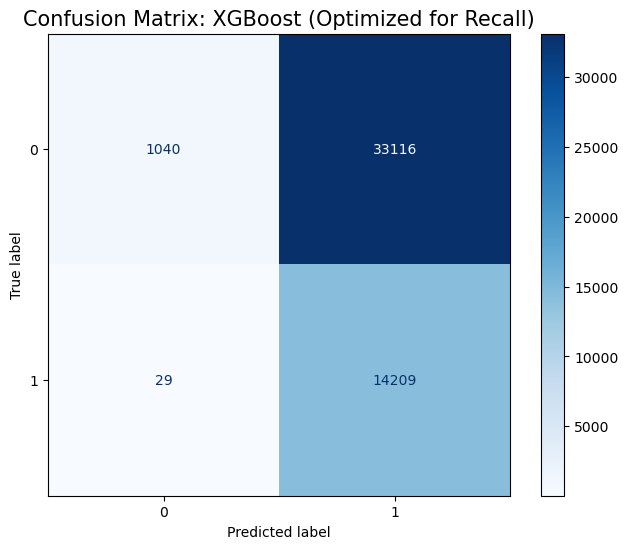
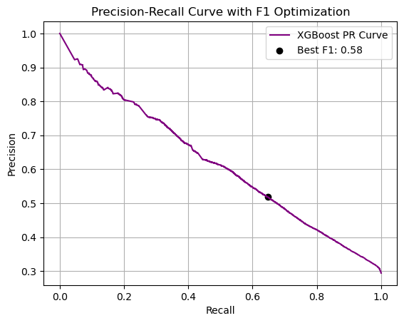
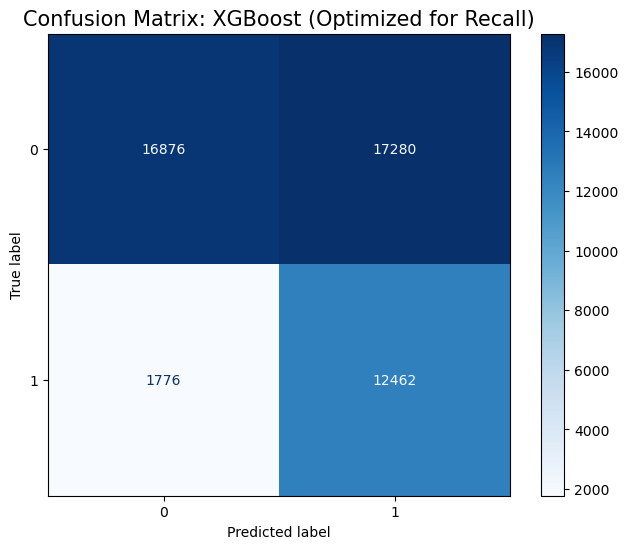
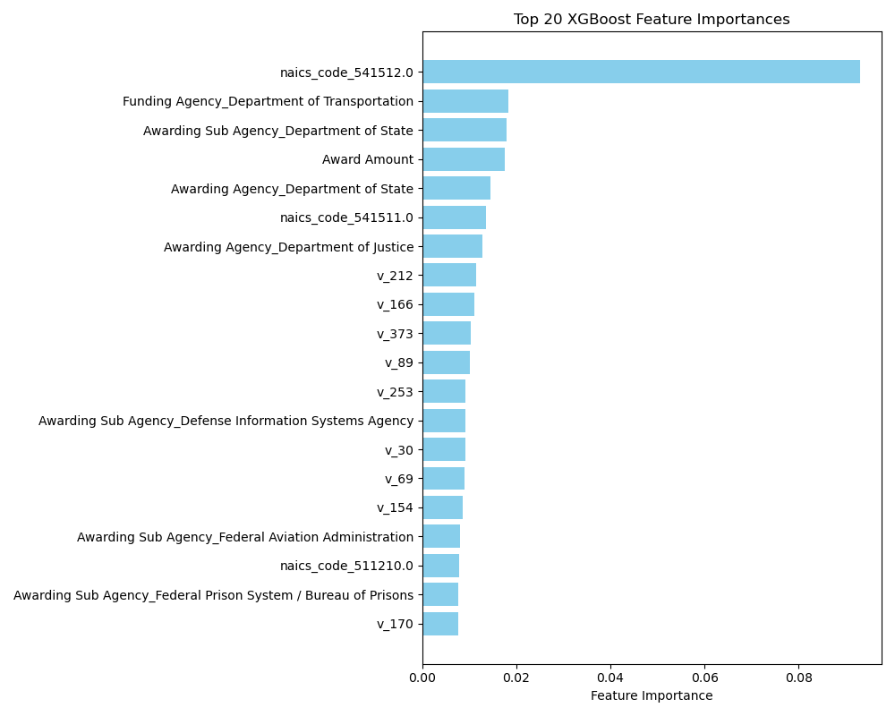
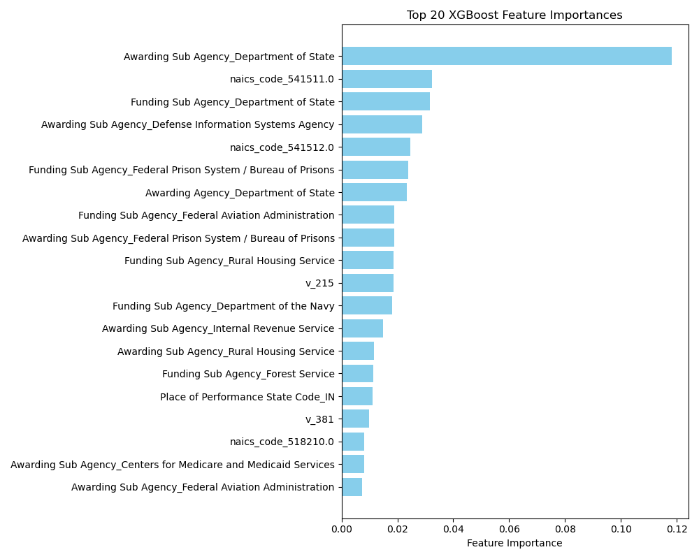

# Week 9 Project Reflection
### What you have achieved so far?
- Within the Training blocks in the Jupyter notebook, I implemented a more robust Try-Except block for saving model evaluation metrics. This accounts for the case where there is no data and there csv does not already exist. Additionally, it handles edge cases and potential duplicates better.

#### V2 Model Training:

##### Modifications with Embeddings
- Given the conversation about the business context for modifications on a contract, it makes sense that a busienss user would care more about optimizing recall. Originally, I had optimized the f1 score to get a good balance. I think that from a business context, it is more important to identify as many possible modifications, rather than be certain the modification prediction is correct. This is because there will likely be human-in-the-loop at some point, so we want to make sure we are capturing everything for their review.
- Additionally, I moved from a basic grid search to leveraging optuna package and Bayesian Optimization. This both increases the efficiency of hyperparameter tuning, as well as the overall performance since the search can cover a larger amount of more applicable hyperparameters.

**Results:**
- After running 50 Bayesian trials, I optimized recall almost perfectly with the hyperparameters: ```Best Params: {'n_estimators': 101, 'learning_rate': 0.013377833484615667, 'max_depth': 4, 'scale_pos_weight': 7.7432624038742475}```

- As shown in the results below, although reccal reached 0.998, precision was too low at 0.30. This actually led to a decrease in the total F1-score to 0.462. The goal is to increase recall, but keep or increase the best F1 Score. Although we care about recall more, precision is not unimportant. We have to make sure our results are relatively confident, and are shooting for closer to 40% recall.

###### Next Step: Implement Balancing Mechanism
- I next optimized recall score, but used a methodology to weight how much more important recall is than precision. Using a 2:1 ratio, this method does not entirely ignore precision like before and will increase the F1 score.
- Looking at the precision recall scoring below, we see we can maximize F1 score where the threshold is .73. However, we can maintain a very close F1 score of .56 by decreasing the threshold for a positive class and increasing recall. This allows the model to achieve recall of **.8753**, holding a precision of **.4190**. Due to the cost profile of recall versus precision, this is an acceptable model and **will be the one we deploy in production**.




###### Modification Model Results:
| model_name | precision | recall | f1_score | weighted_avg_f1 | macro_avg_f1 |
| :--- | :---: | :---: | :---: | :---: | :---: |
| **XGBoost_balanced_embed_v2** | **0.4190** | **0.8753** | **0.5667** | 0.6178 | 0.6029 |
| XGBoost_v1 | 0.7277 | 0.4876 | 0.5840 | 0.7820 | 0.7242 |
| XGBoost_embed_v1 | 0.7377 | 0.4824 | 0.5833 | 0.7829 | 0.7247 |
| Decision Tree_v1 | 0.7169 | 0.4324 | 0.5395 | 0.7642 | 0.6987 |
| Random Forest_v1 | 0.6149 | 0.5138 | 0.5598 | 0.7558 | 0.6985 |
| XGBoost_recall_embed_v2 | 0.3002 | 0.9980 | 0.4616 | 0.1775 | 0.2603 |

Additionally, I used XGBoost Feature Importances to look at the driving factors of the model. The most important feature by far is when a contract has NAICS code: **541512**, which is the category **Computer Systems Design Services**. Firms use this code to consult, develop, and install digital systems for government clients.

This actually makes sense that there would be more modifications to a people oriented service, as there is a lot of variability. Thus, government and firms should be aware that this code may be a strong indicator of a modification to a contract within 1-year.

Another important feature is when the Department of State is either the awarding or Funding Sub-agency, which is interesting. Several of the text embeddings are important as well as the Award amount, which is expected as larger contracts should have more variability.



##### Total Value with Embeddings
There was a clear scaling issue in V1 of these models. Additionally, MAPE had large outliers. To address this I took the follow steps below:
- Target Scaling: The model ignores small contracts to focus entirely on the few massive outliers. To focus on this issue, I applied scaling to the target variable as well. 

- MAPE Optimization: I changed the objective function from MAPE to mean squared error. However, since we are using log scales, this effectively acts like a percent error penalty.

- Bayesian Search: I applied Optuna and Bayesian search to more efficiently the hyperparameters and find the best values. This will help with overall efficiency and efficacy of the model.

I noticed that MAPE decreased by an order of magnitude, but is still enormous. There were also huge improvements in MAE and RMSE, but R2 is still low. Ultimately, I believed I could decreased the prediction error <\$6,000,000, with a solid goal of ~ \$2,000,000
```
Final MAPE: 8863641666747441152.0000
Final MAE Score: 754544.6290
Final RMSE Score: 6203614.8148
Final R2 Score: 0.0483
```

**Remove zero value contracts:**
```
Final MAPE: 1095.7206
Final MAE Score: 803781.3850
Final RMSE Score: 6910232.1632
Final R2 Score: 0.0561
Optimized model saved and metrics CSV updated successfully.
```

- This is largely affecting the MAPE, which climbs to infinity if the value is zero
- The use case for this tool will be contract pricing, which will almost never be used to predict a zero value contract.
- If zeros are interesting in the future, this can become a binary classification task

Additionally, I used XGBoost Feature Importances to look at the driving factors of the model. The most important feature is when the Department of State is either the awarding or Funding Sub-agency, which is interesting. One potential explanation is that Department of State relies on massive contracts rather than smaller multi-year vehicles.


### What you are happy with, from your project work so far

### What you are struggling with, or what challenges you are facing next 

### Anything else you’d specifically like the course staff to focus on in giving you feedback or advice
